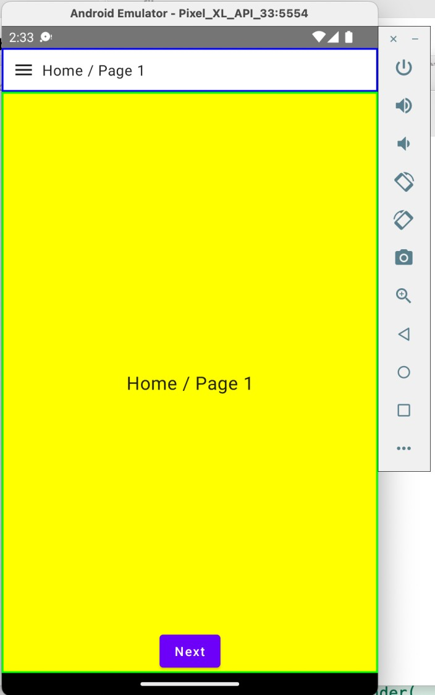
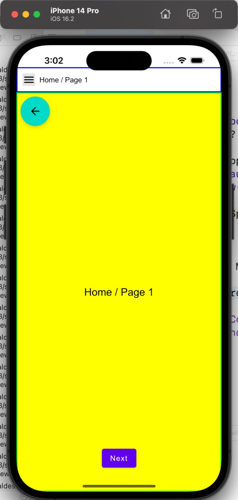
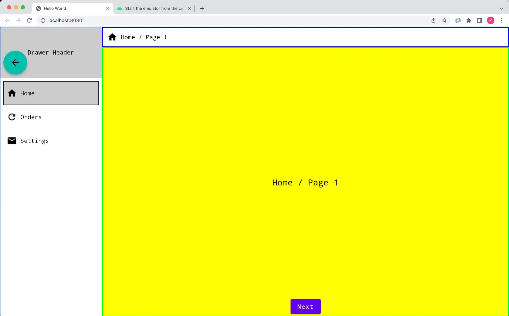

# Templato
Templato is a set of kotlin multiplatform template projects, ready to adapt to a specific business. Each template has navigation and UI ready, the only part missing is to integrate business logic.

Each template produces an Android, iOS, Browser and JVM application. The user of the template is responsible for the business logic and deployment of the App. Check each individual example and the wiki pages for the concepts behind templato.

## UiState3

